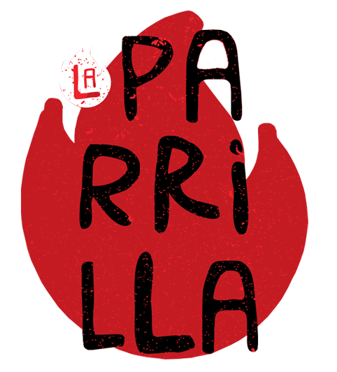

    
    

        
    
            	
         
    

 

<h2>🔖 Descrição:</h2>

Laparrilla é um website food-comerce.
 

<h2>🚀 Tecnologias:</h2>

<ul >
   <li><a href="https://create-react-app.dev/" target="_blank">React</a></li>
    <li><a href="https://reactrouter.com/" target="_blank">React Router</a></li>
    <li><a href="https://axios-http.com/" target="_blank">Axios</a></li>
    <li><a href="https://styled-components.com/" target="_blank">Styled Components</a></li>
</ul> 

<h2>ℹ️  Como utilizar na sua máquina:</h2>

Clone esse repositório: 
    $ git clone https://github.com/Leoodaviid/laparrilla.git
 
 
Instale as dependências: 
$ npm install
 
 
Inicie o projeto no modo de desenvolvimento: 
$ npm start ou yarn start  
 
 
 Inicialize o JSON Server: 
 $ npm run json-server ou yarn run json-server
 
Criado por <a href="https://github.com/Leoodaviid" target="_blank">Leonardo David</a>

